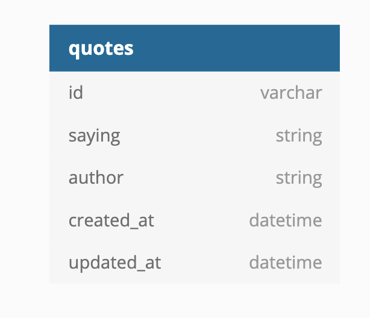

# Splurty 💬

This project demonstrates deployment of app in the ☁️ using Heroku.
A well-defined README<span>.md with use of emojis. 😊

**Splurty** application is hosted on [Heroku](http://curriculum-clark-ngo.herokuapp.com)

## Features
- Randomize GET request
- POST request with simple_form gem
  - :octocat: repository of [simple_form](https://github.com/plataformatec/simple_form) gem
  - get the latest version of [simple_form](https://rubygems.org/gems/simple_form)

## Getting Started

## Schema

Made with [dbdiagram.io](https://dbdiagram.io/home)

## Software requirements

- Rails 5.0.0 or higher

- Ruby 2.3.1 or higher

- PostgreSQL 9.3.11 or higher

## Create Account in GitHub and Heroku

<a href="https://github.com/">GitHub</a>

<a href="https://www.heroku.com/">Heroku</a>

## Configure Heroku with SSH Keys
update the heroku-cli with the following command:
```
wget -qO- https://cli-assets.heroku.com/install-ubuntu.sh | sh
heroku login
heroku keys:add
```

## Test
```
cd /curriculum
rails s -b 0.0.0.0 -p 3000
```

## Clone this repository
```
git clone git@github.com:clarkngo/curriculum.git
```

## Navigate to the Rails application

```
$ cd splurty
```

## Create, migrate and seed the database

 ```
 $ rails db:create
 $ rails db:migrate
 $ rake db:seed
 ```

## Starting the local server

```
$ rails server

   or

$ rails s
```

## Production Deployment

  ```
  $ git push heroku master
  $ heroku run rake db:migrate
  ```
## Support

🐛 Bug reports and feature requests can be filed with the rest for the Ruby on Rails project here:

* [File Bug Reports and Features](https://github.com/clarkngo/curriculum/issues)

## License

curriculum is released under the [MIT license](https://mit-license.org).

## Copyright

copyright:: (c) Copyright 2018 Clark Jason Ngo. All Rights Reserved.


